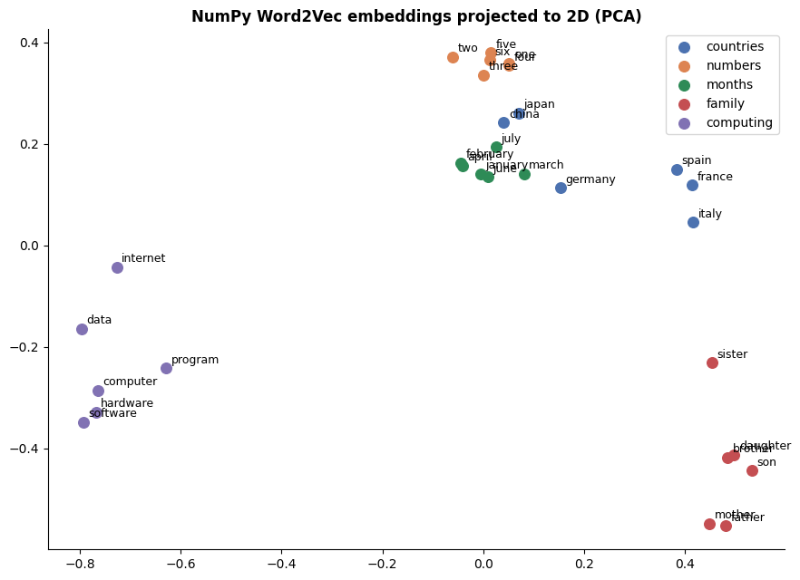
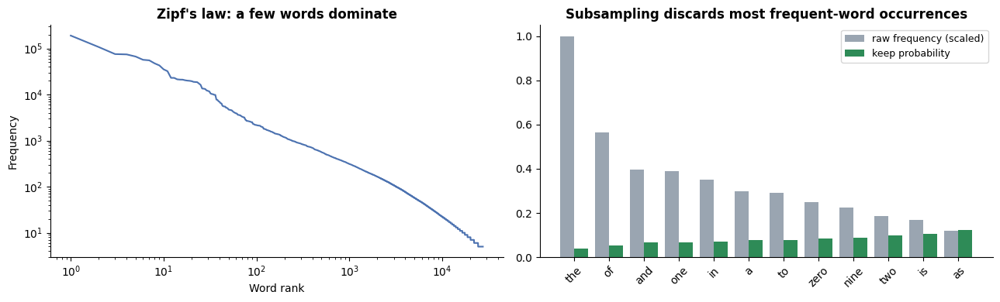
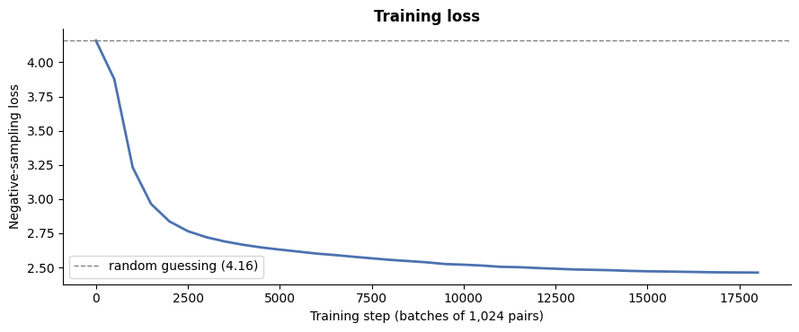

# 🔢 Word2Vec from Scratch in NumPy

[](https://colab.research.google.com/github/MMujtabaX/word2vec-from-scratch/blob/main/word2vec_from_scratch.ipynb)


**Skip-gram with Negative Sampling** (the algorithm behind Word2Vec) implemented with nothing but NumPy: hand-derived gradients verified numerically, subsampling, the unigram^0.75 noise distribution, dynamic windows, and a vectorized training loop. Trained on 3 million words of Wikipedia, it **matches gensim's optimized implementation on standard benchmarks**.

<p align="center">
  
</p>
<p align="center"><sub>Embeddings learned from scratch: numbers, months, countries, family words and computing terms form clear clusters.</sub></p>

## 📊 Results

**Same corpus, same hyperparameters, same evaluation code:**

| Model | WordSim-353 (Spearman) | Google analogies | Training time |
|-------|------------------------|------------------|---------------|
| **NumPy (from scratch)** | **0.364** | 3.2% | 146 s |
| gensim (optimized C) | 0.365 | 3.1% | 14 s |

The from-scratch model reaches the **same quality** as gensim. gensim is about 10× faster, thanks to compiled C code and multithreading.

**Nearest neighbors learned from scratch:**

| Word | Neighbors |
|------|-----------|
| computer | microsoft, software, amiga, macintosh |
| january | february, december, june, october |
| war | civil, battle, vietnam, soviet, troops |
| river | lake, coast, bay, valley, mountains |
| one | seven, six, five, eight, three |

## 🧮 The Math

Each word has an input vector $v$ and an output vector $u$. For a real (center, context) pair plus $K$ random negative words, the loss is:

$$\mathcal{L} = -\log \sigma(u_o^\top v_c) - \sum_{k=1}^{K} \log \sigma(-u_{n_k}^\top v_c)$$

This replaces a softmax over all 27,321 vocabulary words with **6 binary decisions** per pair. The gradients:

$$\frac{\partial \mathcal{L}}{\partial v_c} = (\sigma(u_o^\top v_c) - 1)\,u_o + \sum_k \sigma(u_{n_k}^\top v_c)\,u_{n_k}$$

### ✅ Gradient check
Analytical gradients compared with finite differences:

| Gradient | Relative error |
|----------|----------------|
| ∂L/∂v_c | 2.5 × 10⁻¹⁰ |
| ∂L/∂u_o | 2.1 × 10⁻¹⁰ |
| ∂L/∂u_neg | 5.2 × 10⁻¹⁰ |

## 🔧 Implementation Details

| Component | Detail |
|-----------|--------|
| Corpus | First 3M words of text8 (Wikipedia), vocabulary of 27,321 words (count ≥ 5) |
| Subsampling | Keep probability $\sqrt{t/f} + t/f$ with $t = 10^{-4}$: *"the"* is kept only 4% of the time |
| Noise distribution | Unigram frequency raised to the 0.75 power |
| Dynamic window | Random window size from 1 to 5 per word |
| Training | Mini-batches of 1,024 pairs, 5 negatives each, learning rate decaying linearly from 0.025 |
| Updates | `np.add.at` so repeated words in a batch accumulate correctly |
| Throughput | ~130,000 pairs/second on a single CPU core |

<p align="center">
  
  
</p>

The loss starts exactly at the random-guessing value, $6 \times \ln 2 \approx 4.16$, and falls to 2.48 over 2 epochs (about 19M training pairs).

## 💡 What I Learned

- **Negative sampling** is what makes Word2Vec practical: it turns an expensive V-way softmax into a handful of logistic regressions.
- **Subsampling frequent words** both speeds up training and improves vectors for rarer words.
- **Gradient checking** is essential when deriving gradients by hand.
- **Analogies need far more data than neighbors.** Both implementations reach only ~3% analogy accuracy on 3M words, while neighbors already look excellent. Analogies typically need 100M+ words.
- **Silent truncation is a real trap:** gensim ignores words beyond 10,000 in a single "sentence", so an unsegmented corpus must be chunked first.

## 🚀 Run It

Click the **Open in Colab** badge above and choose **Runtime → Run all**. text8 (31 MB) downloads automatically, and the full run takes about 4 minutes on a CPU.

```bash
pip install numpy pandas matplotlib scikit-learn gensim
```

`gensim` is used only to download the corpus and for the benchmark comparison. The model itself is pure NumPy.

## 🔮 Extensions

- CBOW from scratch
- Hierarchical softmax
- GloVe from co-occurrence counts
- A PyTorch version running on a GPU

## 👤 Author

**Muhammad Mujtaba Khan Suri** — CS @ UBIT, University of Karachi
[GitHub](https://github.com/MMujtabaX)
